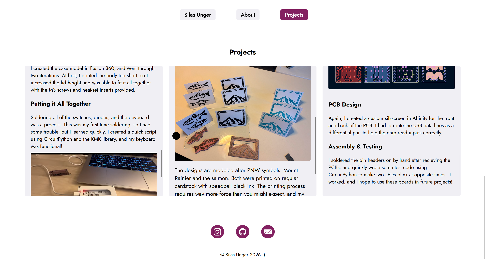
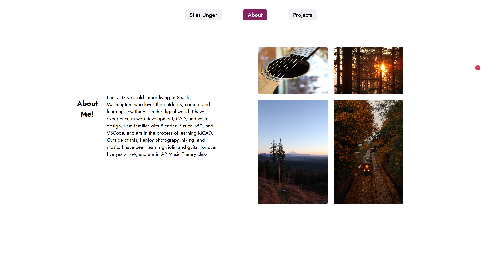
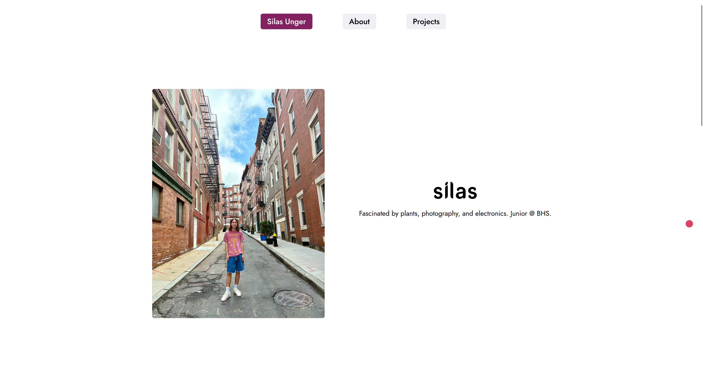

# Silas' Personal Website

This is my personal website that showcases my interests, skills, and recent projects. This website includes three main sections and links to my socials. I created it all in raw HTML, CSS, and JS with help from AI for certain JS sections. It also includes a custom circular cursor which changes size and color when links and buttons are interacted with. I tried to make this website feel very responsive and interactive with JS elements and CSS transitions.

This is one of my first web dev projects, and I am excited to continue coding!

## Cursor

To create my custom cursor, I made a circular div object and hid the original cursor. The new object is controlled by a script which sets its coordinates to the mouses current position. When it detects that you hover over a link, the script changes the class so that its appearance changes.

## Navbar

The bones of my navbar were created with help from the W3schools tutorial, and I added my own twist. I created a script that sets the active button to the correct one based on your scroll position on the page. I also created a custom logotype in Affinity Designer for the homepage.

## Screenshots

